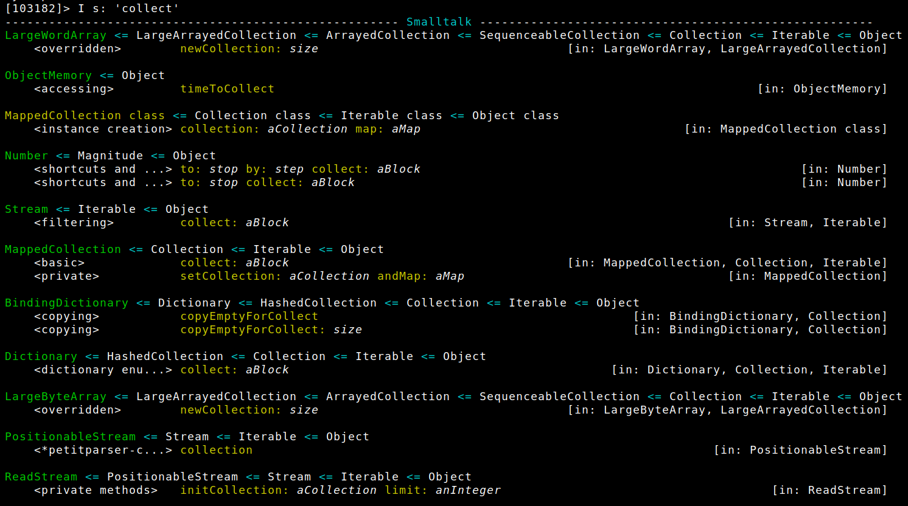
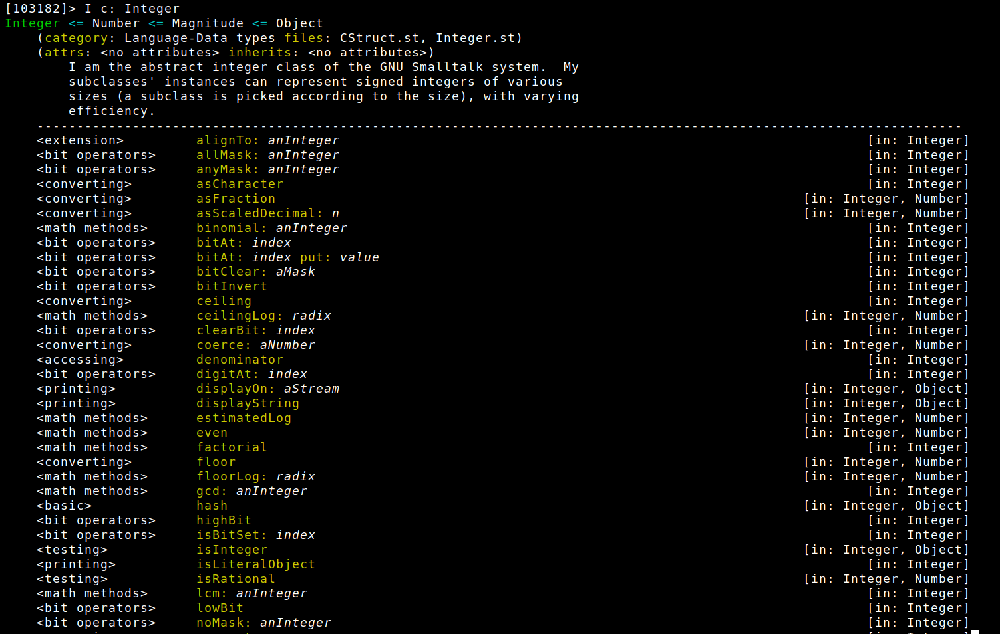
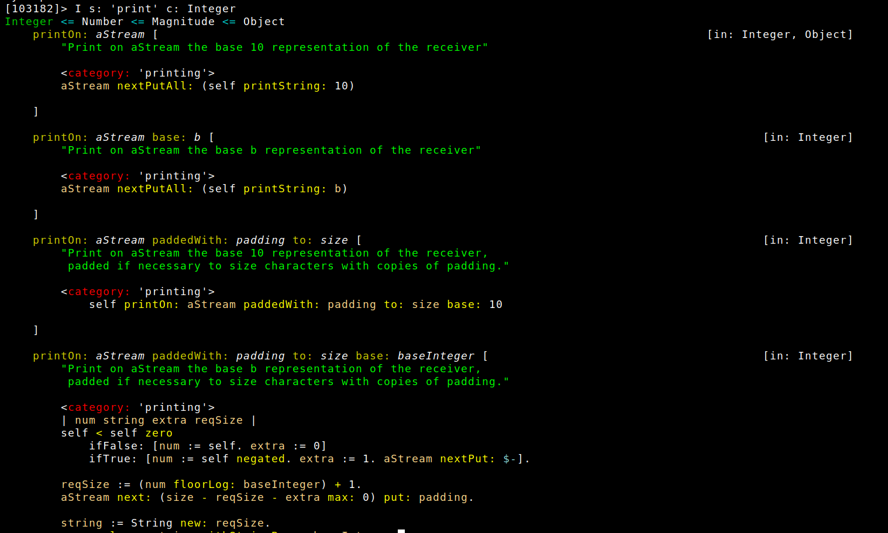

## Nicer REPL for GNU Smalltalk

In the screenshots below:

- `[107402]>` is a REPL prompt showing connection ID
- `I` is an alias for an instance of `MyInspector` class
- `s: aString` on its own means "search for" or "show" (selectors that match the string)
- `c: aClass` on its own means "show class"
- The two above together (`s:c:`) together means "show methods of a class that match the string"







### Notes

<!-- take/drop etc dla streamow -->
<!-- Emacs: pokazywac inst var names klasy at point -->
<!-- doesNotUnderstand albo at override na namespace subclass, potem ustawic jako -->
<!-- environment! haha! -->
<!-- inotifywait & reload ! -->
<!-- ``` -->
<!--     Behavior>>#evaluate:to: -->
<!--     Behavior>>#createGetMethod: -->
<!--     Behavior>>#createSetMethod: -->
<!--     Object printHierarchy -->
<!-- ``` -->

- FileStream class>>#popen:dir: accepts `'w+'` for read-write communication

```
[19189]> p := (FileStream popen: '/bin/cat' dir: 'w+')
<Pipe on /bin/cat>
[19189]> p nextPutAll: ('asdasdasd',String nl)
'asdasdasd
'
[19189]> p nextLine
'asdasdasd'
[19189]> die
nil
[19189]> p close
<Pipe on /bin/cat>
[19189]> p close
<Pipe on /bin/cat>
[19189]> p
<Pipe on /bin/cat>
[19189]> p isOpen
false

```

### TODO

- browse senders - RBBracketedParser on methodSourceString
~/portless/versions/smalltalk/gnu-smalltalk-git/packages/stinst/parser/RBParser.st

- allSelectors - better display, filtering, source code

- http://www.educery.com/papers/modules/

- deep into pharo - exceptions and blocks

- smalltalk/x - minidebugger is better there

- smalltalk/x - has --repl !

- remove wildcard accessor generation (where not needed)

- improve fileIn - parsing


### DONE

- string - visible width / without invisible escape sequences /
    String subclass: ColorizedString

- make #subclass: msg sends clear the methods in the subclass

- diff after loading / after parsing - check if there's a need to remove methods

- inspector help

- track variables in evals - create a class and object for each player
~/portless/versions/smalltalk/gnu-smalltalk-git/packages/visualgst/WorkspaceVariableTracker.st

- DirPackage investigation
